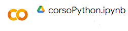

# Portfolio di Lorenzo Domenico Cerantonio

Benvenuti nel mio portfolio! Qui troverete una raccolta dei miei progetti, suddivisi per categoria. <!-- Ogni progetto include una breve descrizione e un link al repository GitHub. -->

## Sommario

- [Progetti Web](#progetti-web)
- [Progetti Python](#progetti-python)
- [Contattami](#contattami)

## Progetti Web

### [Gioco Dadi](https://github.com/Lorix04/GiocoDadi)

Benvenuto nel mio gioco di dadi! In questo gioco, l'utente si sfida contro un bot. 
Ogni giocatore tira un dado e chi ottiene il valore più alto vince la partita.

1. **Lancia il dado**: Il tuo dado verrà lanciato e verrà mostrato il risultato.
2. **Il Bot lancia i dadi**: Il bot lancerà i dadi e verrà mostrato il suo risultato.
3. **Risultato**: Dopo che entrambi i dadi sono stati lanciati, verrà confrontato il valore dei dadi:
   - Se il tuo dado è più alto, vinci!
   - Se il dado del bot è più alto, il bot vince!
   - Se i dadi sono uguali, è un pareggio!

**Tecnologie Usate:**

**Link Sito:** [Clicca qui](http://www.lorenzocerantonio5bi.altervista.org/dadi/index.html)

**Link GitHub:** [Clicca qui](https://github.com/Lorix04/GiocoDadi)

### [Guess Who?](http://www.lorenzocerantonio5bi.altervista.org/IndovinaChi/prova.html)

"Guess Who?" è un coinvolgente gioco web che ho sviluppato, basato sul celebre gioco da tavolo.
L'utente potrà scegliere due modalità:
- **Indovina PC:** Il PC dovrà indovinare il nostro personaggio  da noi scelto facendoci delle domande.
- **Indovina Utente:** L'utente farà delle domande al PC per indovinare il personaggio da lui scelto.

**Tecnologie Usate:** HTML/JS/CSS

### [Pizzeria Puzza](http://www.lorenzocerantonio5bi.altervista.org/Guzzetta/login.html)

Ho sviluppato un sito web per una pizzeria. Il sito include una pagina di accesso e registrazione per gli utenti, una home che presenta la pizzeria e le sue specialità e un menu dettagliato con tutte le pizze disponibili, complete di descrizioni e prezzi.

**Tecnologie Usate:** HTML/JS/CSS/PHP/jQuery

## Progetti Python

### [Python da 0](https://colab.research.google.com/drive/1YusyKj-pGpYsNQGc88sLvBo3hFjnGrLO?usp=sharing)

In questo progetto ho usato Google Colab per imparare Python direttamente dal browser scrivendo tutte le funzioni base e usando degli esempi.
<!--
### [Nome del Progetto 4](https://github.com/tuo-username/nome-del-progetto-4)

Descrizione breve del progetto 4. Spiega cosa fa il progetto, i dataset utilizzati, le tecniche di analisi e qualsiasi altra informazione rilevante.

## Progetti di Automazione

### [Nome del Progetto 5](https://github.com/tuo-username/nome-del-progetto-5)

Descrizione breve del progetto 5. Spiega cosa fa il progetto, gli strumenti di automazione utilizzati e qualsiasi altra informazione rilevante.

### [Nome del Progetto 6](https://github.com/tuo-username/nome-del-progetto-6)

Descrizione breve del progetto 6. Spiega cosa fa il progetto, gli strumenti di automazione utilizzati e qualsiasi altra informazione rilevante.

## Altro

### [Nome del Progetto 7](https://github.com/tuo-username/nome-del-progetto-7)

Descrizione breve del progetto 7. Spiega cosa fa il progetto e qualsiasi altra informazione rilevante.

### [Nome del Progetto 8](https://github.com/tuo-username/nome-del-progetto-8)

Descrizione breve del progetto 8. Spiega cosa fa il progetto e qualsiasi altra informazione rilevante.
-->
---

## Contattami

- **Email:** lorenzo.domenico.cerantonio@gmail.com
- **LinkedIn:** www.linkedin.com/in/lorenzo-cerantonio-4830052bb
<!-- - **Sito Web:** [Il tuo sito web personale](https://tuo-sito-web.com) -->

Grazie per aver visitato il mio portfolio!

